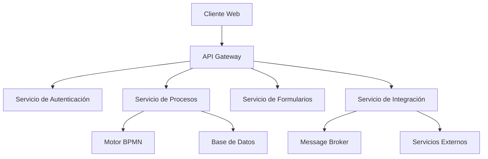

# Arquitectura Técnica

## Visión General

Arkflows está construido sobre una arquitectura moderna y escalable que permite la gestión eficiente de procesos de negocio y la integración con sistemas externos.

## Componentes Principales

### 1. Frontend
- **Framework**: React.js
- **Editor BPMN**: bpmn-js
- **Gestión de Estado**: Redux
- **UI Components**: Material-UI
- **Formularios**: React Hook Form

### 2. Backend
- **Runtime**: Node.js
- **Framework**: Express.js
- **Base de Datos**: PostgreSQL
- **Motor de Procesos**: Camunda
- **Caché**: Redis

### 3. Servicios de Integración
- **API Gateway**: Kong
- **Message Broker**: RabbitMQ
- **Servicio de Correo**: SendGrid
- **Almacenamiento**: AWS S3

## Diagrama de Arquitectura

## Flujo de Datos

1. **Recepción de Solicitudes**
   - El cliente envía solicitudes a través del API Gateway
   - Validación de autenticación y autorización
   - Enrutamiento a los servicios correspondientes

2. **Procesamiento de Procesos**
   - El motor BPMN ejecuta los procesos definidos
   - Gestión de estados y transiciones
   - Persistencia de datos en la base de datos

3. **Integración con Sistemas**
   - Comunicación asíncrona a través del Message Broker
   - Manejo de colas y eventos
   - Integración con sistemas externos

## Seguridad

### 1. Autenticación
- OAuth 2.0 / OpenID Connect
- JWT para tokens de sesión
- Autenticación multifactor

### 2. Autorización
- Control de acceso basado en roles (RBAC)
- Políticas de seguridad granulares
- Auditoría de acciones

### 3. Protección de Datos
- Cifrado en tránsito (TLS)
- Cifrado en reposo
- Gestión segura de secretos

## Escalabilidad

### 1. Horizontal
- Balanceo de carga
- Replicación de servicios
- Distribución geográfica

### 2. Vertical
- Optimización de recursos
- Caché distribuido
- Particionamiento de datos

## Monitoreo y Logging

### 1. Métricas
- Prometheus para recolección
- Grafana para visualización
- Alertas configurables

### 2. Logging
- ELK Stack
- Trazabilidad de procesos
- Análisis de rendimiento

## Despliegue

### 1. Infraestructura
- Contenedores Docker
- Orquestación con Kubernetes
- CI/CD con GitHub Actions

### 2. Ambientes
- Desarrollo
- Pruebas
- Producción

## Consideraciones Técnicas

### 1. Rendimiento
- Optimización de consultas
- Caché de datos frecuentes
- Compresión de respuestas

### 2. Disponibilidad
- Alta disponibilidad
- Recuperación ante desastres
- Backups automáticos

### 3. Mantenibilidad
- Código modular
- Documentación técnica
- Pruebas automatizadas 