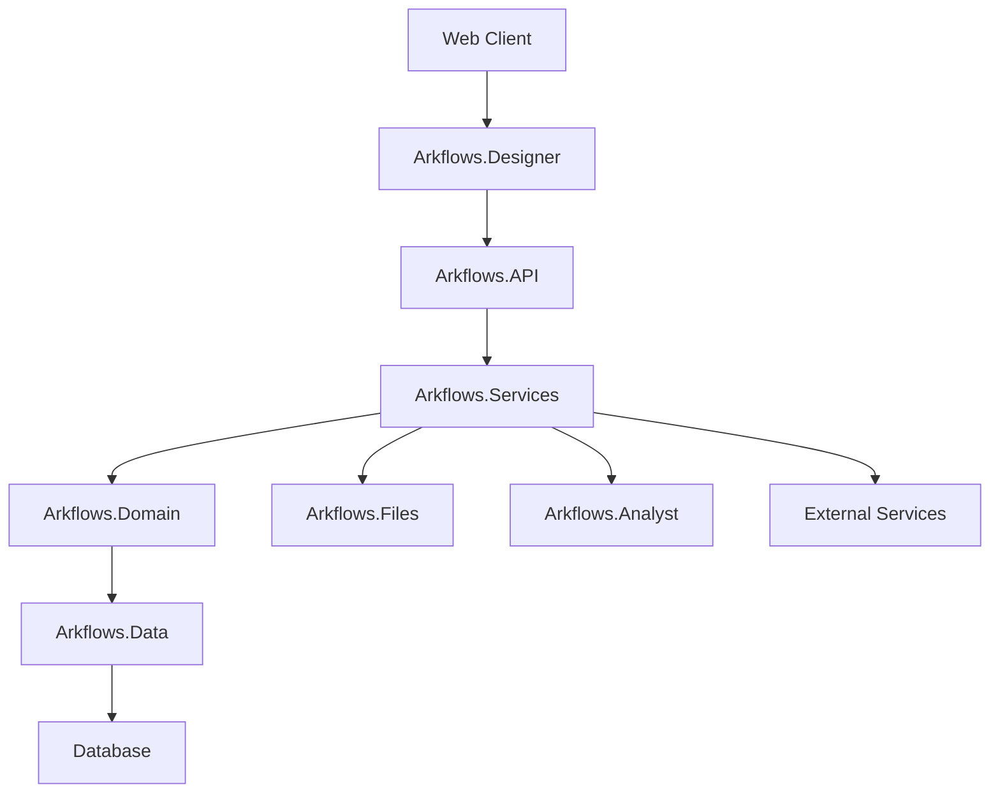

# Technical Architecture

## Overview

Arkflows is built on a .NET-based architecture that enables efficient business process management and integration with external systems. The platform is organized into several specialized components that work together to provide a comprehensive BPM solution.

## Main Components

### 1. Frontend Components
- **Arkflows.Designer**: Web-based process designer interface
  - ASP.NET Web Forms application
  - Custom JavaScript components
  - CSS and font resources
  - Authentication and session management

### 2. Backend Services
- **Arkflows.API**: Main API service
  - ASP.NET Web API
  - RESTful endpoints
  - Authentication and authorization
  - Service integrations

- **Arkflows.Services**: Core business services
  - Process execution engine
  - Task management
  - Form processing
  - Integration services

### 3. Domain and Data
- **Arkflows.Domain**: Business logic and entities
  - Process definitions
  - Form models
  - Business rules
  - Domain services

- **Arkflows.Data**: Data access layer
  - Database interactions
  - Data models
  - Repository implementations
  - Data migrations

### 4. Additional Components
- **Arkflows.Files**: File management service
- **Arkflows.Analyst**: Analytics and reporting
- **Arkflows.DB**: Database management
- **Arkflows.WindowsService**: Background services

## Architecture Diagram

## Data Flow

1. **Request Processing**
   - Client requests handled by Arkflows.Designer
   - API requests processed by Arkflows.API
   - Business logic executed in Arkflows.Services
   - Data operations managed by Arkflows.Data

2. **Process Execution**
   - Process definitions stored in domain layer
   - Execution managed by service layer
   - State persisted in database
   - Events handled by Windows Service

3. **Integration Flow**
   - External system connections via API
   - File operations through Files service
   - Analytics processed by Analyst service
   - Background tasks in Windows Service

## Security

### 1. Authentication
- ASP.NET Forms Authentication
- Session management
- Secure cookie handling
- Login/Logout flows

### 2. Authorization
- Role-based access control
- Permission management
- Resource protection
- Action auditing

### 3. Data Protection
- Secure configuration
- Encrypted connections
- Protected resources
- Secure file handling

## Scalability

### 1. Application Scaling
- Load balancing support
- Session management
- Resource optimization
- Caching strategies

### 2. Data Scaling
- Database optimization
- Query performance
- Connection management
- Data partitioning

## Monitoring and Logging

### 1. Application Monitoring
- NLog configuration
- Error tracking
- Performance monitoring
- Usage analytics

### 2. System Monitoring
- Windows Service monitoring
- Resource utilization
- Health checks
- Alert configuration

## Deployment

### 1. Application Deployment
- Web application deployment
- Service deployment
- Configuration management
- Environment setup

### 2. Database Deployment
- Schema management
- Data migration
- Backup procedures
- Recovery processes

## Technical Considerations

### 1. Performance
- Query optimization
- Resource management
- Caching implementation
- Response optimization

### 2. Availability
- High availability setup
- Disaster recovery
- Backup strategies
- Failover procedures

### 3. Maintainability
- Code organization
- Documentation
- Testing strategy
- Update procedures 