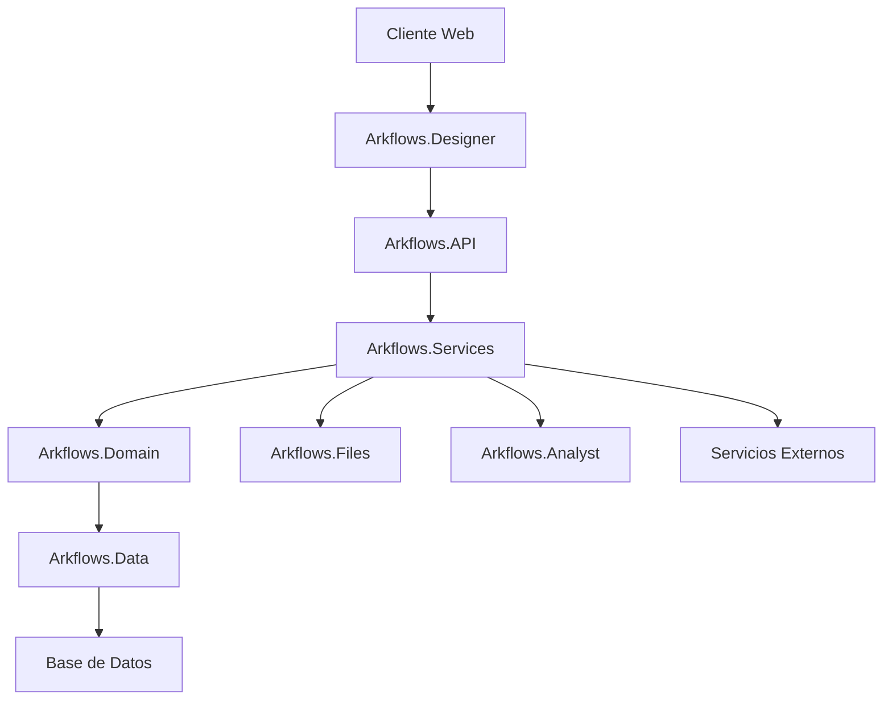

# Arquitectura Técnica

## Descripción General

Arkflows está construido sobre una arquitectura basada en .NET que permite una gestión eficiente de procesos de negocio e integración con sistemas externos. La plataforma está organizada en varios componentes especializados que trabajan juntos para proporcionar una solución BPM integral.

## Componentes Principales

### 1. Componentes Frontend
- **Arkflows.Designer**: Interfaz web del diseñador de procesos
  - Aplicación ASP.NET Web Forms
  - Componentes JavaScript personalizados
  - Recursos CSS y fuentes
  - Gestión de autenticación y sesión

### 2. Servicios Backend
- **Arkflows.API**: Servicio API principal
  - ASP.NET Web API
  - Endpoints RESTful
  - Autenticación y autorización
  - Integraciones de servicios

- **Arkflows.Services**: Servicios de negocio principales
  - Motor de ejecución de procesos
  - Gestión de tareas
  - Procesamiento de formularios
  - Servicios de integración

### 3. Dominio y Datos
- **Arkflows.Domain**: Lógica de negocio y entidades
  - Definiciones de procesos
  - Modelos de formularios
  - Reglas de negocio
  - Servicios de dominio

- **Arkflows.Data**: Capa de acceso a datos
  - Interacciones con base de datos
  - Modelos de datos
  - Implementaciones de repositorio
  - Migraciones de datos

### 4. Componentes Adicionales
- **Arkflows.Files**: Servicio de gestión de archivos
- **Arkflows.Analyst**: Análisis y reportes
- **Arkflows.DB**: Gestión de base de datos
- **Arkflows.WindowsService**: Servicios en segundo plano

## Diagrama de Arquitectura

## Flujo de Datos

1. **Procesamiento de Solicitudes**
   - Solicitudes de cliente manejadas por Arkflows.Designer
   - Solicitudes API procesadas por Arkflows.API
   - Lógica de negocio ejecutada en Arkflows.Services
   - Operaciones de datos gestionadas por Arkflows.Data

2. **Ejecución de Procesos**
   - Definiciones de proceso almacenadas en capa de dominio
   - Ejecución gestionada por capa de servicio
   - Estado persistido en base de datos
   - Eventos manejados por Windows Service

3. **Flujo de Integración**
   - Conexiones a sistemas externos vía API
   - Operaciones de archivo a través del servicio Files
   - Análisis procesados por el servicio Analyst
   - Tareas en segundo plano en Windows Service

## Seguridad

### 1. Autenticación
- Autenticación de Formularios ASP.NET
- Gestión de sesión
- Manejo seguro de cookies
- Flujos de inicio/cierre de sesión

### 2. Autorización
- Control de acceso basado en roles
- Gestión de permisos
- Protección de recursos
- Auditoría de acciones

### 3. Protección de Datos
- Configuración segura
- Conexiones cifradas
- Recursos protegidos
- Manejo seguro de archivos

## Escalabilidad

### 1. Escalado de Aplicación
- Soporte para balanceo de carga
- Gestión de sesión
- Optimización de recursos
- Estrategias de caché

### 2. Escalado de Datos
- Optimización de base de datos
- Rendimiento de consultas
- Gestión de conexiones
- Particionamiento de datos

## Monitoreo y Registro

### 1. Monitoreo de Aplicación
- Configuración NLog
- Seguimiento de errores
- Monitoreo de rendimiento
- Análisis de uso

### 2. Monitoreo del Sistema
- Monitoreo de Windows Service
- Utilización de recursos
- Verificaciones de salud
- Configuración de alertas

## Despliegue

### 1. Despliegue de Aplicación
- Despliegue de aplicación web
- Despliegue de servicios
- Gestión de configuración
- Configuración de entorno

### 2. Despliegue de Base de Datos
- Gestión de esquema
- Migración de datos
- Procedimientos de respaldo
- Procesos de recuperación

## Consideraciones Técnicas

### 1. Rendimiento
- Optimización de consultas
- Gestión de recursos
- Implementación de caché
- Optimización de respuestas

### 2. Disponibilidad
- Configuración de alta disponibilidad
- Recuperación ante desastres
- Estrategias de respaldo
- Procedimientos de conmutación por error

### 3. Mantenibilidad
- Organización del código
- Documentación
- Estrategia de pruebas
- Procedimientos de actualización 